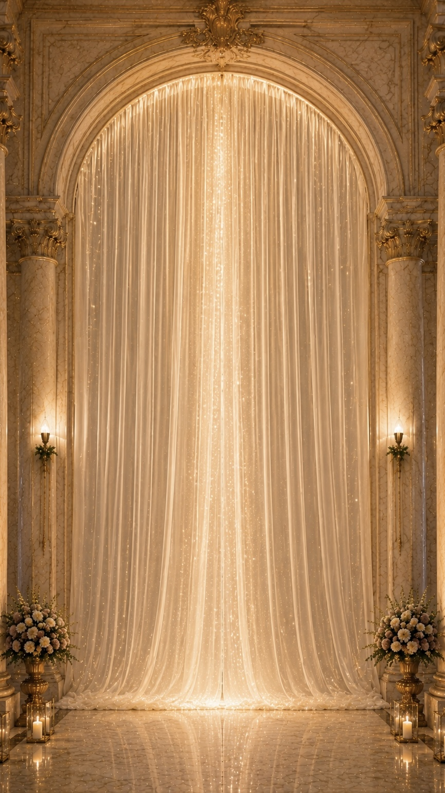

# PROMPT CLAUDE CODE — INVITATION MARIE-PAUL & YANN
# Refactoring complet V44 → V45 Clean
# Repo : kabeyaornella-a11y/marie-paul-yann-invitation

---

## CONTEXTE GÉNÉRAL

Tu travailles sur une invitation de mariage digitale premium (single-page HTML).
Fichier : `index.html` dans le repo `kabeyaornella-a11y/marie-paul-yann-invitation`.

### État actuel du fichier (à ne PAS reproduire)
- ~10 000 lignes dont 8 000 lignes de CSS empilées en patchs V18→V44
- 6 545 occurrences de `!important` — chaque patch écrase le précédent
- 14 `DOMContentLoaded` empilés — 14 initialisations concurrentes qui se battent sur iOS Safari
- 15 `resize` listeners actifs simultanément
- Fonctions redéfinies en double : `ready` × 9, `fitTimeline` × 2, `q` × 2, `qa` × 2, `resize` × 2, `show` × 2
- 2 blocs `<style>` (le second est un patch V44 lignes 9757→9832)
- 2 blocs `<script>` (le second est un patch V44 lignes 9835→9980)
- Keyframes dupliqués : `rsvpConfettiReal` × 4, `citShimmer` × 2
- 308 sélecteurs CSS déclarés en double

### Objectif final
Produire un `index.html` propre avec :
- **1 seul bloc `<style>`**
- **1 seul bloc `<script>`**
- **0 doublon CSS/JS**
- **Rendu visuel identique à la V44**
- **node --check sur le JS extrait → 0 erreur**

---

## RÈGLE N°1 — INVIOLABLE

Ne jamais modifier le rendu visuel.
Si tu as un doute sur une règle CSS → la conserver.
Tester `node --check js_extrait.js` avant toute livraison.

---

## ÉTAPE 1 — AUDIT (ne rien modifier encore)

Génère `audit.md` avec :
- Sélecteurs CSS dupliqués avec nombre d'occurrences (trier par fréquence décroissante)
- Fonctions JS dupliquées avec numéros de ligne
- Nombre exact de DOMContentLoaded, resize listeners, IIFEs
- Keyframes en double
- Poids CSS / JS / HTML en ko séparément
- Liste des `!important` par sélecteur (top 20)

---

## ÉTAPE 2 — FUSION CSS

### Règles de fusion par sélecteur dupliqué
1. Lister TOUTES les déclarations de ce sélecteur dans l'ordre d'apparition
2. Fusionner en 1 seul bloc : union de toutes les propriétés
3. Si même propriété déclarée plusieurs fois → garder la **dernière** valeur
4. Si une valeur contient `!important` → elle gagne sur toutes les autres
5. **Ne jamais supprimer un override intentionnel** (règle plus spécifique qui écrase une générale)

### À conserver intégralement sans modification
- Tous les `@font-face` (ChopinScript est embedé en base64 — ne pas toucher)
- Tous les `@keyframes` (dédupliquer si identiques, sinon garder les deux avec noms différents)
- Tous les `@media` (les fusionner par breakpoint si même condition)

### Sélecteurs critiques à vérifier présents dans le CSS final
```
#topnav, #topnav.scrolled, #enter, #hero, #hero::after
.h-names, .final-h-names, .h-intro, .h-q1, .h-q2, .h-line
.gold-btn, .scratch-frame, .countdown-frame
#rsvp, .rsvp-chapter, .rsvp-form, .rsvp-field, .presence-pill
.story2-cit-text, .story2-ghost-num, .story2-citation
@keyframes shimmer, @keyframes blink, @keyframes eventiaV44Shimmer
@keyframes ctaPulse, @keyframes s2zoom, @keyframes heroStarRise
.place-v09, .c3-wrap, .c3-card, .gift-accord-item
.timeline-b-v7, .es-activities-option3, .envelope-v13-frame
#lang-sw, #mus-btn, #anchor-nav, .anav-dot
```

---

## ÉTAPE 3 — FUSION JS

### Structure du JS propre (ordre à respecter)

```js
// 1. Variables globales et traductions
var LANG = { fr: {...}, en: {...} };
var currentLang = 'fr';

// 2. Fonction ready() — une seule définition globale
function ready(fn) {
  document.readyState === 'loading'
    ? document.addEventListener('DOMContentLoaded', fn)
    : fn();
}

// 3. Fonctions utilitaires globales (une seule définition de chacune)
function q(s, r) { return (r||document).querySelector(s); }
function qa(s, r) { return Array.prototype.slice.call((r||document).querySelectorAll(s)); }

// 4. Fonctions globales appelées en inline HTML
function setLang(l) { ... }      // appelée par onclick="setLang('fr')"
function toggleMusic() { ... }   // appelée par onclick="toggleMusic()"
function sendRsvp() { ... }      // appelée par onclick="sendRsvp()"

// 5. IIFE Porte (opening sequence) — voir détail section 13
(function() { /* porte */ })();

// 6. IIFE Scratch listener
(function() { /* scratch postMessage */ })();

// 7. IIFE Timeline fit
(function() { /* fitTimeline */ })();

// 8. IIFE Scroll reveals (IntersectionObserver)
(function() { /* es-reveal */ })();

// 9. IIFE Carousel images lieux
(function() { /* carousel */ })();  // UNE SEULE — supprimer le doublon

// 10. IIFE Gold particles (#gp-canvas)
(function() { /* gp-canvas */ })();

// 11. IIFE Story2 blocks reveal
(function() { /* story2-block IntersectionObserver */ })();

// 12. IIFE Progress bar
(function() { /* progress-bar */ })();

// 13. IIFE Activities section
(function() { /* es-activities-option3 */ })();

// 14. IIFE Hébergements carousel 3D (c3init, c3go, c3prev, c3next)
(function() { ... })();

// 15. IIFE updateNav (anchor nav dots)
(function() { /* updateNav */ })();

// 16. IIFE RSVP confettis (launchRsvpConfetti)
(function() { ... })();

// 17. IIFE syncMusicButton
(function() { ... })();

// 18. IIFE scroll lang visibility
(function() { ... })();

// 19. IIFE i18n (assignI18n, applyLang, updateLang, boot)
(function() { ... })();

// 20. IIFE boot principal (forceVerse, forceShimmer, tuneHeroStars, wireRsvp, etc.)
(function() { ... })();
```

### Fonctions à supprimer du JS
- `forceShimmer()` — le shimmer sera uniquement CSS (voir correction 2)
- Toutes les définitions redondantes de `ready()` dans les IIFEs (garder uniquement la globale)
- Le doublon exact du carousel IIFE (2e occurrence identique)
- Les fonctions déclarées mais jamais appelées (vérifier)

### Fonctions à conserver impérativement
```
setLang()         — traduction FR/EN, appelée onclick
toggleMusic()     — bouton musique, appelée onclick
sendRsvp()        — formulaire Formspree xqegygee, appelée onclick
doEnter()         — séquence ouverture porte
fitTimeline()     — ajuste hauteur iframe timeline
sweepBible()      — animation verset
wireReplay()      — bouton rejouer
boot()            — initialisation langue
c3init/c3go/c3prev/c3next — carousel hébergements
updateNav()       — points de navigation
launchRsvpConfetti() — confettis RSVP
```

---

## CORRECTIONS VISUELLES ET TECHNIQUES

### 1. BOUTON LANGUE FR/EN

**CSS :**
```css
#lang-sw {
  position: fixed;
  top: calc(env(safe-area-inset-top, 0px) + 12px);
  right: 14px;
  z-index: 2100;
  display: flex;
  align-items: center;
  gap: 2px;
  height: 34px;
  border-radius: 999px;
  padding: 3px;
  background: rgba(247,239,227,.7);
  border: 1px solid rgba(174,126,50,.35);
  backdrop-filter: blur(10px);
  -webkit-backdrop-filter: blur(10px);
  opacity: 1;
  visibility: visible;
  transition: opacity 0.3s ease, visibility 0.3s ease;
}
body.lang-hidden #lang-sw {
  opacity: 0;
  visibility: hidden;
  pointer-events: none;
}
#lang-sw button {
  width: 34px; height: 100%;
  border-radius: 999px;
  background: transparent; border: 0;
  font-family: 'Cinzel', serif; font-size: 10px;
  color: #8b6838; cursor: pointer;
}
#lang-sw button.active {
  background: #9a6c35; color: #fff8ec;
}
```

**JS :**
```js
// Dans le scroll listener — seuil 30px
window.addEventListener('scroll', function() {
  var y = window.scrollY || document.documentElement.scrollTop || 0;
  document.body.classList.toggle('lang-hidden', y > 30);
}, {passive: true});
```

**Règle absolue :** Ne jamais appliquer `position:fixed` sur `#lang-sw` via JS inline. Le topnav (`#topnav`) doit rester `position:fixed` en permanence.

---

### 2. SHIMMER PRÉNOMS (.h-names, .final-h-names)

**CSS uniquement — supprimer forceShimmer() du JS :**
```css
.h-names,
.final-h-names {
  font-family: 'ChopinScript', 'Great Vibes', cursive;
  font-size: clamp(42px, 10.8vw, 76px);
  line-height: 1.18;
  white-space: nowrap;
  background: linear-gradient(
    105deg,
    #7A4B20 0%, #B99048 18%, #F3D391 34%,
    #FFF3C1 48%, #C99A45 63%, #8A5B1E 78%, #F3D391 100%
  );
  background-size: 300% auto;
  -webkit-background-clip: text;
  background-clip: text;
  -webkit-text-fill-color: transparent;
  color: transparent;
  animation: shimmerGold 4.4s ease-in-out infinite;
}

@keyframes shimmerGold {
  0%   { background-position: 0% center; }
  50%  { background-position: 100% center; }
  100% { background-position: 0% center; }
}
```

---

### 3. VERSET MATTHIEU 19:6

**CSS — spécificité maximale pour écraser tous les patches précédents :**
```css
.story2-chapter .story2-citation {
  display: block !important;
  visibility: visible !important;
  opacity: 1 !important;
}
.story2-chapter .story2-citation .story2-cit-text {
  display: block !important;
  visibility: visible !important;
  opacity: 1 !important;
  clip-path: none !important;
  transform: none !important;
}
.story2-chapter .story2-citation .story2-cit-text span {
  display: block !important;
  visibility: visible !important;
  opacity: 1 !important;
  clip-path: none !important;
  transform: none !important;
  color: #7A5030 !important;
  font-family: 'Cormorant Garamond', serif !important;
  font-style: italic !important;
  font-size: clamp(15px, 3.8vw, 22px) !important;
  line-height: 1.7 !important;
}
.story2-cit-ref {
  opacity: 1 !important;
  visibility: visible !important;
  color: #B99048 !important;
  font-family: 'Cinzel', serif !important;
  font-size: 11px !important;
  letter-spacing: .2em !important;
}
```

**JS — dans le boot(), appeler :**
```js
function showVerse() {
  var c = q('.story2-citation');
  if (c) {
    c.style.cssText = '';  // reset inline styles
    c.classList.add('s2-in');
  }
}
```

---

### 4. CONFETTIS APRÈS RÉVÉLATION DE LA DATE

**JS — listener postMessage :**
```js
(function() {
  function hideInst() {
    var el = q('#notre-date .date-instruction-below');
    if (el) el.classList.add('is-hidden-after-scratch');
  }

  function revealCalBtn() {
    var btn = document.getElementById('calendarBtnParent');
    if (btn) btn.classList.add('eventia-revealed');
  }

  window.addEventListener('message', function(e) {
    if (!e.data) return;
    var t = e.data.type, a = e.data.action;

    if (t === 'eventia-scratch-start' || t === 'eventia-scratch-complete') hideInst();

    if (t === 'eventia-scratch-complete' || t === 'eventia-date-revealed' || a === 'confetti') {
      revealCalBtn();
      // 3 vagues de confettis
      setTimeout(function() { if (typeof window.eventiaFinalConfetti === 'function') window.eventiaFinalConfetti(); }, 200);
      setTimeout(function() { if (typeof window.eventiaFinalConfetti === 'function') window.eventiaFinalConfetti(); }, 700);
      setTimeout(function() { if (typeof window.eventiaFinalConfetti === 'function') window.eventiaFinalConfetti(); }, 1400);
    }
  });
})();
```

**CSS — bouton calendrier caché par défaut :**
```css
#calendarBtnParent {
  display: none;
  opacity: 0;
  transition: opacity 0.5s ease;
}
#calendarBtnParent.eventia-revealed {
  display: inline-flex;
  opacity: 1;
}
```

---

### 5. ESPACES VIDES (padding inter-sections réduit)

```css
/* Toutes les sections es-section */
.es-section {
  padding: clamp(10px, 2vh, 22px) 18px;
}

/* Sections spécifiques */
.date-chapter    { padding: clamp(10px,2vh,22px) 18px clamp(8px,1.5vh,16px); }
.countdown-chapter { padding: clamp(8px,1.5vh,16px) 18px; }
.story2-chapter  { padding: clamp(10px,2vh,22px) 0; }
.program-chapter { padding: clamp(10px,2vh,22px) 18px 0; }
#dresscode       { padding: 0 18px; margin: 0; }
#hebergements    { padding-top: clamp(8px,1.5vh,16px); margin-top: 0; }
#autour          { padding: clamp(8px,1.5vh,16px) 18px; }
#empreintes      { padding: clamp(8px,1.5vh,16px) 18px; }
#cadeaux         { padding: clamp(8px,1.5vh,16px) 18px; }
#rsvp            { padding: clamp(10px,2vh,22px) 18px; }
#remerciements   { padding: clamp(8px,1.5vh,16px) 18px clamp(6px,1vh,12px); }
```

---

### 6. DRESS CODE IFRAME

```css
#dresscode { overflow: visible; padding: 0; margin: 0; }
#dresscode .es-inner { overflow: visible; padding: 0; }
.dress-frame {
  width: 100%;
  height: clamp(900px, 158vw, 1080px);
  border: 0;
  display: block;
  overflow: visible;
  background: transparent;
}
@media (min-width: 760px) {
  .dress-frame { height: 960px; }
}
```

---

### 7. TIMELINE IFRAME (bordure invisible)

```css
.timeline-exact-frame,
#timelineExactFrame {
  border: 0 !important;
  box-shadow: none !important;
  background: transparent !important;
  outline: none !important;
}
.timeline-exact-wrapper {
  border: 0;
  box-shadow: none;
  background: transparent;
  overflow: hidden;
}
```

---

### 8. RSVP CENTRÉ DANS LE RIDEAU

```css
.rsvp-chapter > .es-inner {
  width: clamp(190px, 46vw, 300px);
  max-width: 300px;
  margin: 0 auto;
}
@media (max-width: 390px) {
  .rsvp-chapter > .es-inner {
    width: 54vw;
    max-width: 220px;
  }
}
```

---

### 9. PHRASE INTRO HÉRO

```css
.h-intro {
  position: absolute;
  top: 5%;
  left: 50%;
  transform: translateX(-50%);
  width: 78vw;
  text-align: center;
  font-family: 'Cinzel', serif;
  font-size: clamp(9px, 2.2vw, 13px);
  letter-spacing: .22em;
  color: rgba(243,213,138,.9);
  text-shadow: 0 1px 10px rgba(0,0,0,.65);
  white-space: normal;
  opacity: 0;
  transition: opacity 1.4s ease .5s;
}
#hero.active .h-intro { opacity: 1; }
```

---

### 10. ACCORDION CADEAUX

```css
.gift-accord-body {
  max-height: 0;
  overflow: hidden;
  transition: max-height 0.4s ease, padding 0.3s ease;
  padding: 0 20px;
  text-align: center;
}
.gift-accord-body.open {
  max-height: 400px;
  padding: 14px 20px 20px;
}
.gift-accord-header[aria-expanded="true"] .gift-accord-arrow {
  transform: rotate(90deg);
  transition: transform 0.3s ease;
}
```

---

### 11. TOPNAV (scrolled state)

```css
#topnav {
  position: fixed !important;
  top: 0;
  left: 0;
  right: 0;
  z-index: 2000;
  height: 52px;
  display: flex;
  align-items: center;
  justify-content: flex-end;
  padding: 0 18px;
  gap: 10px;
  background: transparent;
  transition: background .4s, border-color .4s;
}
#topnav.scrolled {
  background: rgba(247,239,227,.9);
  backdrop-filter: blur(12px);
  -webkit-backdrop-filter: blur(12px);
  border-bottom: 1px solid rgba(183,143,67,.15);
}
```

---

### 12. PERFORMANCE

- Ne pas mettre `loading="lazy"` sur les iframes `scratch` et `countdown`
- Supprimer les 13 `DOMContentLoaded` redondants → garder 1 seul via `ready()`
- Supprimer les `resize` listeners redondants → garder 1 seul avec debounce
- Supprimer les keyframes dupliqués (`rsvpConfettiReal`, `citShimmer`)

---

### 13. OPENING PORTE — SÉQUENCE LUMIÈRE ET FONDU

**Structure HTML (#enter) — ne pas modifier :**
```html
<div id="enter">
  
  <video id="vid"
    src="https://res.cloudinary.com/didid8vcu/video/upload/q_auto/f_auto/v1780082988/2026-05-29_21_29_06_aciw5j.mp4"
    muted playsinline webkit-playsinline preload="auto">
  </video>
  <canvas id="glow"></canvas>
  <div id="wash"></div>
  <div id="cta">
    <span id="cta-text">Vivre l'expérience</span>
    <div id="cta-line"></div>
  </div>
</div>
```

**CSS :**
```css
#enter {
  position: fixed; inset: 0; z-index: 9000;
  background: #0a0604;
  cursor: pointer; overflow: hidden;
  -webkit-tap-highlight-color: transparent;
  user-select: none;
}
#enter.hide { display: none; }

#enter video {
  position: absolute; inset: 0;
  width: 100%; height: 100%;
  object-fit: cover; object-position: center top;
  z-index: 2; opacity: 0;
}
#enter .door-img {
  position: absolute; inset: 0;
  width: 100%; height: 100%;
  object-fit: cover; object-position: center top;
  z-index: 1; opacity: 1;
}
#glow {
  position: absolute; inset: 0;
  width: 100%; height: 100%;
  pointer-events: none;
  mix-blend-mode: screen; z-index: 3; opacity: 0;
}
#wash {
  position: absolute; inset: 0;
  background: #FFF7EF; opacity: 0; z-index: 4;
  pointer-events: none;
}
#cta {
  position: absolute;
  bottom: clamp(52px, 9vh, 92px);
  left: 50%; transform: translateX(-50%);
  z-index: 5; text-align: center;
  transition: opacity .5s;
}
#cta-text {
  display: block;
  font-family: 'Cinzel', serif;
  font-size: clamp(11px, 3vw, 16px);
  letter-spacing: .38em;
  text-transform: uppercase;
  color: rgba(255,248,230,.92);
  text-shadow: 0 0 18px rgba(243,213,138,.5);
  animation: blink 2.2s ease-in-out infinite;
}
#cta-line {
  width: 1px; height: 40px;
  background: rgba(255,248,230,.5);
  margin: 12px auto 0;
  animation: ctaPulse 1.8s ease-in-out infinite;
}
@keyframes ctaPulse {
  0%,100% { opacity:.4; transform:scaleY(.8); }
  50%      { opacity:1;  transform:scaleY(1); }
}
#hero-veil {
  position: absolute; inset: 0;
  background: #FFF7EF; z-index: 10;
  pointer-events: none; opacity: 1;
  transition: opacity 0.65s cubic-bezier(.4,0,.2,1);
}
```

**JS — IIFE Porte complète :**
```js
(function() {
  var enter  = document.getElementById('enter');
  var vid    = document.getElementById('vid');
  var wash   = document.getElementById('wash');
  var cta    = document.getElementById('cta');
  var glowC  = document.getElementById('glow');
  var gCtx   = glowC ? glowC.getContext('2d') : null;
  var hero   = document.getElementById('hero');
  var audio  = document.getElementById('audio');
  var veil   = document.getElementById('hero-veil');
  var langSw = document.getElementById('lang-sw');
  var started = false;

  // Paramètres timing vidéo
  var GLOW_START = 8.0, FADE_START = 10.2, FADE_DUR = 0.9, FALLBACK = 18.0;

  // Resize canvas glow
  function resizeGlow() {
    if (!glowC || !enter) return;
    glowC.width = enter.offsetWidth;
    glowC.height = enter.offsetHeight;
  }
  resizeGlow();
  window.addEventListener('resize', resizeGlow);

  // Dessin du halo lumineux
  function drawGlow(p) {
    if (!gCtx || !glowC) return;
    gCtx.clearRect(0, 0, glowC.width, glowC.height);
    if (p <= 0) return;
    var W = glowC.width, H = glowC.height;
    var cx = W * .5, cy = H * .24;
    var rX = W * .22 * (1 + p * .4);
    var rY = H * .18 * (1 + p * .3);
    var g = gCtx.createRadialGradient(cx, cy, 0, cx, cy, Math.max(rX, rY));
    g.addColorStop(0,   'rgba(255,248,220,' + (.85 * p) + ')');
    g.addColorStop(.35, 'rgba(243,213,138,' + (.55 * p) + ')');
    g.addColorStop(.7,  'rgba(200,170,80,'  + (.22 * p) + ')');
    g.addColorStop(1,   'rgba(0,0,0,0)');
    gCtx.save();
    gCtx.scale(1, rY / rX);
    gCtx.beginPath();
    gCtx.arc(cx, cy * (rX / rY), rX, 0, Math.PI * 2);
    gCtx.fillStyle = g;
    gCtx.fill();
    gCtx.restore();
    glowC.style.opacity = p;
  }

  // Tick animation glow sur timeupdate vidéo
  function onTimeUpdate() {
    if (!vid) return;
    var t = vid.currentTime;
    if (t >= GLOW_START) {
      var p = Math.min((t - GLOW_START) / 1.8, 1);
      drawGlow(p);
    }
    if (t >= FADE_START) {
      var fp = Math.min((t - FADE_START) / FADE_DUR, 1);
      if (wash) wash.style.opacity = fp * .92;
    }
  }

  // Séquence entrée principale
  function doEnter() {
    if (started) return;
    started = true;

    // Stocker en session
    try { sessionStorage.setItem('eventiaEntered', '1'); } catch(e) {}

    // Cacher CTA
    if (cta) cta.style.opacity = '0';

    // Transition #enter → invisible → caché
    if (enter) {
      enter.style.transition = 'opacity 0.9s ease';
      enter.style.opacity = '0';
      setTimeout(function() {
        enter.classList.add('hide');
      }, 900);
    }

    // Révéler hero (veil opacity → 0)
    if (veil) {
      setTimeout(function() {
        veil.style.opacity = '0';
        setTimeout(function() { veil.style.display = 'none'; }, 700);
      }, 300);
    }

    // Activer le hero
    if (hero) {
      setTimeout(function() { hero.classList.add('active'); }, 400);
    }

    // Musique
    if (audio) {
      audio.volume = 0.22;
      try { audio.currentTime = 0; } catch(e) {}
      audio.play().then(function() {
        var btn = document.getElementById('mus-btn');
        if (btn) { btn.textContent = '♫'; btn.classList.add('is-playing'); }
      }).catch(function() {});
    }

    // Rendre le bouton langue visible
    if (langSw) {
      langSw.style.cssText = '';
      document.body.classList.remove('lang-hidden');
    }
  }

  // Si déjà visité → entrer direct sans animation
  try {
    if (sessionStorage.getItem('eventiaEntered') === '1') {
      if (enter) enter.classList.add('hide');
      if (veil)  { veil.style.opacity = '0'; veil.style.display = 'none'; }
      if (hero)  hero.classList.add('active');
      started = true;
      return;
    }
  } catch(e) {}

  // Lancer la vidéo
  if (vid) {
    vid.addEventListener('canplay', function() {
      vid.style.opacity = '1';
    }, {once: true});
    vid.play().catch(function() {
      // Fallback : afficher door-entrance.jpeg
      var img = enter ? enter.querySelector('.door-img') : null;
      if (img) img.style.opacity = '1';
      if (vid) vid.style.opacity = '0';
    });
    vid.addEventListener('timeupdate', onTimeUpdate);
    vid.addEventListener('ended', doEnter);
  }

  // Clic utilisateur
  if (enter) enter.addEventListener('click', doEnter);

  // Auto-enter après 18 secondes
  var autoTimer = setTimeout(doEnter, FALLBACK * 1000);

  // Annuler l'auto-timer si l'utilisateur clique
  if (enter) enter.addEventListener('click', function() {
    clearTimeout(autoTimer);
  }, {once: true});

})();
```

---

### 14. MUSIQUE

**HTML :**
```html
<audio id="audio" src="musique.m4a" loop preload="auto"></audio>
```

**JS — fonction toggleMusic() :**
```js
function toggleMusic() {
  var a = document.getElementById('audio');
  var b = document.getElementById('mus-btn');
  if (!a) return;
  if (a.paused) {
    a.volume = 0.22;
    try { a.currentTime = a.currentTime; } catch(e) {}
    a.play().then(function() {
      if (b) { b.textContent = '♫'; b.classList.add('is-playing'); }
    }).catch(function() {});
  } else {
    a.pause();
    if (b) { b.textContent = '♪'; b.classList.remove('is-playing'); }
  }
}
```

**CSS bouton musique :**
```css
#mus-btn {
  width: 36px; height: 36px;
  border-radius: 50%;
  background: rgba(247,239,227,.6);
  border: 1px solid rgba(174,126,50,.3);
  backdrop-filter: blur(10px);
  color: #9a7133; font-size: 14px;
  display: flex; align-items: center; justify-content: center;
  cursor: pointer;
  -webkit-tap-highlight-color: transparent;
}
#mus-btn.is-playing { color: #B99048; }
```

---

## ASSETS — NE PAS RENOMMER

```
couple-hero.png           → section hero
couple-cadre-baroque.png  → section finale
door-entrance.jpeg        → porte (fallback vidéo)
musique.m4a               → audio loop
fond-rideaux-rsvp-transparent.png → RSVP
mairie-civile-1.jpg, mairie-civile-2.jpg, mairie-civile-3.jpg
salle.jpg.jpg, salle2.jpg.jpg, salle3.jpg.png, salle4.jpg.png
couple-story-1.jpg, couple-story-2.jpg, couple-story-4.jpg, couple-story-5.jpg
lustre-principal.png.png  → section compte à rebours
cadre-frame.png           → carousels lieux
icone-avion-voyage.svg, icone-cadeaux.svg, icone-iban.svg
assets/activities/chateau-fontainebleau.jpg
assets/activities/foret-fontainebleau.jpg
assets/activities/parrot-world.jpg
assets/icon_camera.png
```

---

## IFRAMES — NE PAS MODIFIER LE CONTENU

Ces fichiers sont autonomes — toucher uniquement le CSS de l'iframe parente dans index.html :
```
scratch/index.html       → .scratch-frame (height:300px mobile, 420px desktop)
countdown/index.html     → .countdown-frame (height:300px mobile, 230px <640px)
timeline-B-v15c.html     → #timelineExactFrame (fitTimeline dynamique)
dresscode-v5.html        → .dress-frame
envelope-v13.html        → .envelope-v13-frame
```

---

## VALIDATION FINALE

```bash
# 1. Extraire le JS
python3 -c "
import re
with open('index.html','r') as f: c=f.read()
js=c[c.rfind('<script>')+8:c.rfind('</script>')]
open('check.js','w').write(js)"

# 2. Vérifier syntaxe
node --check check.js && echo 'JS OK' || echo 'ERREUR JS'

# 3. Vérifier présence sections HTML
for id in notre-date compte-a-rebours notre-histoire les-lieux programme dresscode hebergements autour empreintes cadeaux rsvp remerciements photo-finale; do
  grep -q "id=\"$id\"" index.html && echo "✓ $id" || echo "✗ MANQUANT $id"
done

# 4. Vérifier sélecteurs CSS critiques
for sel in '#topnav' '#hero' '.h-names' '.gold-btn' 'shimmerGold' 'ctaPulse' '#rsvp' '.story2-cit-text'; do
  grep -q "$sel" index.html && echo "✓ $sel" || echo "✗ MANQUANT $sel"
done
```

---

## LIVRAISON

1. `index.html` — fichier propre reconstruit
2. `rapport_nettoyage.md` — liste exacte de chaque suppression/fusion effectuée

